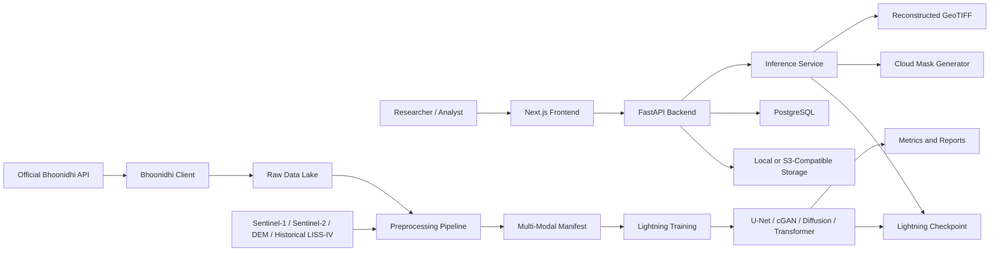

# Architecture Diagram

## Data Contract

Training batches use:

- `inputs`: stacked cloudy LISS-IV, Sentinel-1, Sentinel-2, DEM, historical LISS-IV
- `target`: cloud-free LISS-IV
- `scene_id`: reproducibility identifier

The backend accepts a GeoTIFF upload and runs mask generation plus model inference. For full multi-modal production inference, prepare a stacked input GeoTIFF with the same channel order used during training.
